# Sluice job store: ERD (draft, 4 Oct 2026)

The full PostgreSQL ERD for the ingestion job store: 21 tables and 19 foreign keys.
16 tables are in the code today. Migration `0005_q4_operations` (the Q4 POC) adds 5 more, plus `job_tasks.heartbeat_at` and `retry_at`.

- **Complete DDL:** [`jobstore_schema.sql`](jobstore_schema.sql). It was loaded into PostgreSQL 16 without errors: 21 tables, 19 FKs, 68 indexes.
- **Rendered image:** [`jobstore_erd_full.png`](jobstore_erd_full.png) / [`.svg`](jobstore_erd_full.svg)
- **Slide 10e:** [`ing-erd.html`](ing-erd.html), preview [`erd_preview.png`](erd_preview.png). It shows keys only.

## Things to know when reading it

- Every `id` is a UUID kept as `varchar(36)` and generated by the app. JSON columns are `jsonb`.
- `tenant_id` is on every table, but it is a real FK only on `users`. Tenant isolation is enforced in the API.
- Some columns are logical links with no FK:
  - `pipelines.template_id`
  - `schedules.last_job_id`
  - `reconciliation_runs.pipeline_id` and `job_id`
  - every id in `audit_events`
- Tables with no FKs: `audit_events`, `uploads`, `templates`, `secrets`. `secrets` is in the code but is not used in Q4; credentials come from env vars.
- Defaults and NOT NULL follow the models. The defaults are set by the app, not by the server.
- Migration 0005 creates its columns as nullable, so in a live database the five Q4 tables are looser than the models.
- Marked `UK` means unique. On `pipeline_objects` and `watermarks` the key covers two columns: `(pipeline_id, object_key)` and `(pipeline_id, pipeline_object_id)`.

```mermaid
erDiagram
    tenants ||--o{ users : "tenant_id"
    connections ||--o{ pipelines : "connection_id"
    targets ||--o{ pipelines : "target_id"
    pipelines ||--o{ pipeline_objects : "pipeline_id"
    pipelines ||--o{ jobs : "pipeline_id"
    jobs ||--o{ job_tasks : "job_id"
    pipeline_objects ||--o{ job_tasks : "pipeline_object_id"
    jobs ||--o{ job_events : "job_id"
    job_tasks |o--o{ job_events : "job_task_id"
    pipelines ||--o{ watermarks : "pipeline_id"
    pipeline_objects ||--o| watermarks : "pipeline_object_id"
    job_tasks ||--o{ validation_results : "job_task_id"
    jobs ||--o{ job_metrics : "job_id"
    pipelines ||--o| schedules : "pipeline_id"
    alert_channels ||--o{ alert_deliveries : "channel_id"
    pipelines ||--o{ reconciliation_specs : "pipeline_id"
    pipeline_objects ||--o| reconciliation_specs : "pipeline_object_id"
    targets ||--o{ reconciliation_specs : "legacy_target_id"
    reconciliation_specs ||--o{ reconciliation_runs : "spec_id"
    tenants {
        varchar(36) id PK
        varchar(200) name
        varchar(100) slug UK
        timestamptz created_at
        timestamptz updated_at
    }
    users {
        varchar(36) id PK
        varchar(36) tenant_id FK
        varchar(320) email UK
        varchar(200) password_hash
        varchar(40) role "Role enum (5 RBAC roles)"
        boolean is_active
        boolean is_platform_admin "may cross tenants"
        timestamptz created_at
        timestamptz updated_at
    }
    connections {
        varchar(36) id PK
        varchar(36) tenant_id
        varchar(200) name
        varchar(50) type "mssql, postgres, sftp ..."
        jsonb config "never holds credentials"
        varchar(200) credential_ref "null · pointer, value comes from env"
        varchar(36) created_by "null"
        boolean is_active
        timestamptz created_at
        timestamptz updated_at
    }
    secrets {
        varchar(36) id PK
        varchar(200) ref UK
        text ciphertext
        integer key_version
        timestamptz created_at
    }
    targets {
        varchar(36) id PK
        varchar(36) tenant_id
        varchar(200) name
        varchar(50) type "s3 | sftp | gcs | azure"
        jsonb config
        varchar(200) credential_ref "null"
        varchar(36) created_by "null"
        timestamptz created_at
        timestamptz updated_at
    }
    templates {
        varchar(36) id PK
        varchar(36) tenant_id "null · NULL = global template"
        varchar(200) name
        text description "null"
        jsonb config
        boolean is_global
        varchar(36) created_by "null"
        timestamptz created_at
        timestamptz updated_at
    }
    pipelines {
        varchar(36) id PK
        varchar(36) tenant_id
        varchar(200) name
        varchar(36) connection_id FK
        varchar(36) target_id FK
        jsonb config "full pipeline config"
        varchar(36) template_id "null · logical link to templates, no FK"
        varchar(36) created_by "null"
        boolean is_active
        timestamptz created_at
        timestamptz updated_at
    }
    pipeline_objects {
        varchar(36) id PK
        varchar(36) pipeline_id FK,UK
        varchar(20) object_type "table | file"
        varchar(200) schema_name "null"
        varchar(400) object_name "null · tables only"
        varchar(600) object_key UK "'dbo.customer' or a file path"
        boolean selected
        varchar(400) target_folder "null"
        varchar(200) watermark_column "null"
        jsonb discovered_schema "null"
        bigint row_count_estimate "null"
        timestamptz last_profiled_at "null"
        timestamptz created_at
        timestamptz updated_at
    }
    jobs {
        varchar(36) id PK
        varchar(36) tenant_id
        varchar(30) job_number UK
        varchar(36) pipeline_id FK
        varchar(20) status
        varchar(20) mode "full | incremental"
        integer parallelism
        integer batch_size
        varchar(36) created_by "null"
        timestamptz started_at "null"
        timestamptz finished_at "null"
        timestamptz created_at
    }
    job_tasks {
        varchar(36) id PK
        varchar(36) job_id FK
        varchar(36) pipeline_object_id FK
        varchar(20) status
        integer attempt "fencing token"
        bigint rows_read
        bigint rows_written
        bigint bytes_read
        bigint bytes_written
        varchar(200) watermark_value "null"
        jsonb partition "null · {'column','min','max'}"
        jsonb output_files "null · removed before a re-run"
        text error "null"
        timestamptz started_at "null"
        timestamptz finished_at "null"
        timestamptz heartbeat_at "null · Q4 POC: every 30 s while RUNNING"
        timestamptz retry_at "null · Q4 POC: RETRY_WAIT -> PENDING at"
    }
    job_events {
        varchar(36) id PK
        varchar(36) job_id FK
        varchar(36) job_task_id FK "null · NULL = job-level event"
        timestamptz ts
        varchar(10) level "info | ok | warn | error"
        varchar(30) phase "queue | extract | normalize | load | validate | job"
        text message
        jsonb detail "null"
    }
    watermarks {
        varchar(36) id PK
        varchar(36) tenant_id
        varchar(36) pipeline_id FK,UK
        varchar(36) pipeline_object_id FK,UK
        varchar(200) watermark_value
        timestamptz updated_at
    }
    validation_results {
        varchar(36) id PK
        varchar(36) job_task_id FK
        varchar(50) check_name "row_count | schema_match | nulls ..."
        text source_value "null"
        text target_value "null"
        varchar(10) status "PASS | FAIL | WARN"
        text detail "null"
        timestamptz created_at
    }
    job_metrics {
        varchar(36) id PK
        varchar(36) job_id FK
        bigint rows_processed
        bigint bytes_processed
        float8 duration_seconds "null"
        float8 records_per_sec "null"
        float8 mb_per_sec "null"
        timestamptz captured_at
    }
    audit_events {
        varchar(36) id PK
        varchar(36) tenant_id "null"
        varchar(36) user_id "null"
        varchar(100) action
        varchar(50) resource_type "null"
        varchar(36) resource_id "null"
        varchar(36) job_id "null"
        jsonb detail
        varchar(64) ip "null"
        timestamptz created_at
    }
    uploads {
        varchar(36) id PK
        varchar(36) tenant_id
        varchar(500) filename
        varchar(1000) stored_path
        bigint size
        varchar(64) sha256 "null"
        varchar(20) status
        varchar(36) created_by "null"
        timestamptz created_at
    }
    schedules {
        varchar(36) id PK
        varchar(36) tenant_id
        varchar(36) pipeline_id FK,UK
        varchar(100) cron "5-field cron, in timezone"
        varchar(64) timezone
        varchar(20) mode "full | incremental"
        boolean enabled
        varchar(10) overlap "skip while the last run is unfinished"
        timestamptz next_run_at "null"
        timestamptz last_run_at "null"
        varchar(36) last_job_id "null · logical link to jobs, no FK"
        varchar(40) last_outcome "null · started | skipped_overlap | error"
        varchar(36) created_by "null"
        timestamptz created_at
        timestamptz updated_at
    }
    alert_channels {
        varchar(36) id PK
        varchar(36) tenant_id
        varchar(200) name
        varchar(20) kind "teams | slack"
        varchar(200) credential_ref
        jsonb events
        boolean enabled
        timestamptz created_at
        timestamptz updated_at
    }
    alert_deliveries {
        varchar(36) id PK
        varchar(36) tenant_id
        varchar(36) channel_id FK
        varchar(40) event
        varchar(200) dedupe_key UK
        varchar(10) status "sent | failed"
        integer http_status "null"
        varchar(300) title
        jsonb detail "null"
        timestamptz created_at
    }
    reconciliation_specs {
        varchar(36) id PK
        varchar(36) tenant_id
        varchar(36) pipeline_id FK
        varchar(36) pipeline_object_id FK,UK
        varchar(36) legacy_target_id FK
        varchar(600) legacy_path "glob under the target's base path"
        varchar(20) legacy_format "csv | parquet"
        jsonb key_columns
        jsonb ignore_columns
        float8 numeric_tolerance
        boolean enabled
        timestamptz created_at
        timestamptz updated_at
    }
    reconciliation_runs {
        varchar(36) id PK
        varchar(36) tenant_id
        varchar(36) spec_id FK
        varchar(36) pipeline_id "logical link, no FK"
        varchar(36) job_id "null · logical link, no FK"
        varchar(10) status "PASS | FAIL | ERROR"
        bigint platform_rows "null"
        bigint legacy_rows "null"
        jsonb result
        timestamptz created_at
    }
```

